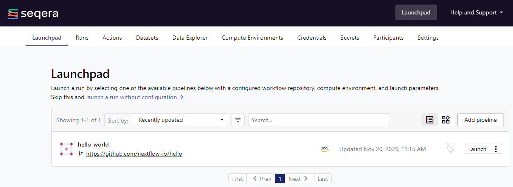

## Setup pipelines on Seqera Platform

### Table of contents
1. [Prerequisites](#1-prerequisites)
2. [Overview](#2-overview)
3. [Tutorial: Adding a pipeline to the Launchpad](#3-tutorial-adding-a-test-pipeline-to-the-launchpad)
   - [YAML format description](#yaml-format-description)
   - [Dry run mode](#dry-run-mode)
   - [Adding the pipeline](#adding-the-pipeline)
4. [Add your workflow to the Launchpad](#4-add-your-workflow-to-the-launchpad)

### 1. Prerequisites

- You have setup a Fusion V2 and plain S3 compute environment in the Seqera Platform in the [previous section](../02_setup_compute/README.md).
- You have created an S3 bucket for saving the workflow outputs.
- For effective use of resource labels, you have setup Split Cost Allocation tracking in your AWS account and activated the tags as mentioned in [this guide](https://docs.seqera.io/platform/24.1/compute-envs/aws-batch#split-cost-allocation-tracking). << this link broken, not sure what the corect one would be
- If using private repositories, you have added your GitHub (or other VCS provider) credentials to the Seqera Platform workspace.

### 2. Overview

This directory contains YAML configuration files to add your workflow to the Seqera Platform Launchpad, as well as add the [nextflow-io/hello](https://github.com/nextflow-io/hello) workflow to the Seqera Platform Launchpad:

- `example_workflow_A_fusion.yml`: This configuration is to setup your custom workflow for benchmarking to run on Fusion V2 with the 6th generation intel instance type with NVMe storage. This workflow will use the `aws_fusion_nvme` compute environment created in the [previous section](../02_setup_compute/README.md#1-fusion-enabled-compute-environment).
- `example_workflow_A_plains3.yml`: This configuration is to setup your custom workflow for benchmarking to run on plain AWS Batch with S3 storage. This workflow will use the `aws_plain_s3` compute environment created in the [previous section](../02_setup_compute/README.md#2-plain-s3-compute-environment).
- `hello-world.yml`: This configuration is to setup the [nextflow-io/hello](https://github.com/nextflow-io/hello) workflow to run on the Seqera Platform. This workflow will use the `aws_fusion_nvme` compute environment created in the [previous section](../02_setup_compute/README.md#1-fusion-enabled-compute-environment).


We can start by adding a simple Hello World pipeline to the Launchpad and then launching this in your chosen Workspace. This will ensure that `seqerakit` is working as expected and you are able to correctly add and launch a pipeline.

### 3. Tutorial: Adding a test pipeline to the Launchpad

Before we add our custom workflow to the Launchpad, let's start by adding the Hello World pipeline to the Launchpad as defined in [`hello-world.yml`](../seqerakit/pipelines/hello-world.yml).

#### YAML format description

We can start by checking the YAML configuration file which defines the pipeline we will add to the workspace. The pipeline definition can be found at [`hello-world.yml`](./pipelines/hello_world.yml). Inspecting the contents here the file contains the following values:

```yaml
pipelines:
  - name: "nf-hello-world-test"
    url: "https://github.com/nextflow-io/hello"
    workspace: '$ORGANIZATION_NAME/$WORKSPACE_NAME'
    description: "Classic Hello World script in Nextflow language."
    compute-env: "aws_fusion_nvme"
    revision: "master"
    overwrite: True
```

The YAML file begins with a block starting with the key `pipelines` which mirrors the command available on the Seqera Platform CLI to add pipelines to the Launchpad i.e. `tw pipelines add`. To give you another example, if you would like to create a Compute Environment in the Seqera Platform, you would use the `tw add compute-envs` command and hence the `compute-envs` key in your YAML file, and so on.

The nested options in the YAML also correspond to options available for that particular command on the Seqera Platform CLI. For example, if you run `tw pipelines add --help` you will see that `--name`, `--workspace`, `--description`, `--compute-env` and `--revision` are available as options, and will be provided to the `tw launch` command as defined in this YAML via `seqerakit`. However, other options defined in the YAML such as `url` and `overwrite` have been added specifically to extend the functionality in `seqerakit`.

You will also notice that we have defined environment variables in the YAML that should now be available in your executing environment on the command-line as outlined in the [Define your environment variables](./seqerakit.md#define-your-environment-variables) section.

#### Dry run mode

Before we add the pipeline to the Launchpad let's run `seqerakit` in dry run mode. This will print the CLI commands that will be executed by `seqerakit` without actually deploying anything to the platform.

Run the following command in the root directory of this tutorial material:

```bash
seqerakit --dryrun ./pipelines/hello_world.yml
```

You should see the following output appear in the shell:

```shell
INFO:root:DRYRUN: Running command tw pipelines add --name nf-hello-world-test --workspace $ORGANIZATION_NAME/$WORKSPACE_NAME --description 'Classic Hello World script in Nextflow language.' --compute-env aws_fusion_nvme --revision master https://github.com/nextflow-io/hello
```

This indicates seqerakit is interpreting the YAML file and is able to run some commands. Check the commands written to the console. Do they look reasonble? If so, we can proceed to the next step.

#### Adding the pipeline

We will now add the pipeline to the Launchpad by removing the `--dryrun` option from the command-line:

```bash
seqerakit ./seqerakit/pipelines/hello-world.yml
```

Output will be like:

```shell
DEBUG:root: Overwrite is set to 'True' for pipelines

DEBUG:root: Running command: tw -o json pipelines list -w $ORGANIZATION_NAME/$WORKSPACE_NAME
DEBUG:root: Running command: tw pipelines add --name nf-hello-world-test --workspace $ORGANIZATION_NAME/$WORKSPACE_NAME --description 'Classic Hello World script in Nextflow language.' --compute-env aws_fusion_nvme --revision master https://github.com/nextflow-io/hello
```

Go to the Launchpad page on your workspace on Seqera platform. You should see the hello world pipeline available to launch.



### 4. Add your workflow to the Launchpad

Now that you have confirmed your seqerakit setup is working and added the hello world pipeline, you will need to complete the configuration for each of your custom workflows before you can add them to the Launchpad with details specific to your workflow.

1. Navigate to the `pipelines/` directory.
2. Open the `example_workflow_A_fusion.yml` file and edit the details for your workflow in a text editor. Specifically, at the minimum you will need to set the following details:

    - `url`: The URL of the workflow repository on GitHub. 
        Note: If you are using a private repository, you will need to ensure your repository credentials have been added to the Seqera Platform workspace where you are running the workflow.
    - `description`: A short description of the workflow.
    - `profile`: The profile to use for the workflow. For example, if you were using the `nf-core/rnaseq` workflow, you will need to set the `profile` to `test` or `test_full` depending on the tests you want to run. If you are not specifying a profile, you can remove this line.
    - `revision`: The revision of the workflow to use for the workflow. This is the branch name, tag or the commit hash to use for the workflow.
    - `params`: The parameters to use for the workflow. This is a list of parameters the workflow will use on the Launchpad. These can be specified as a list of key-value pairs inline or as a path to a file containing the parameters with the `params-file:` option.
    - `pre-run`: The pre-run script to use for the workflow. This is a path to a script that will be run before the workflow is run. This can be used to setup the workflow environment. We have commented out a pre-run script in the example YAML file.
    - `labels`: The labels to use for the workflow. This is a list of labels to use for the workflow. These can be used to organise the workflow runs in the Seqera Platform.


        The remaining details are optional and can be used to customise your workflow run.

        A few of the details have been set for you in the example workflows. These are to ensure that the workflow run is configured to run on the Seqera Platform with the appropriate compute environment.

        ---

        **_NOTE:_** We have [specified a local path](https://github.com/ejseqera/biorad-fusion-benchmark/blob/39692088753e3c45b199310dcb8bcffe061bc195/03_setup_pipelines/pipelines/example_workflow_A_fusion.yml#L9) to a [Nextflow config file](./pipelines/nextflow.config) through the `config:` option. This config file includes custom configuration settings for attaching resource labels to each process in the workflow. These resource labels will attach metadata such as the unique run id, pipeline name, process name, and so on, to each task submitted to AWS Batch. 
        
        ```json
        process {
        resourceLabels = {[
                uniqueRunId: System.getenv("TOWER_WORKFLOW_ID"),
                pipelineProcess: task.process.toString(),
        ...
        ```
        
        This config is required to retrieve effective cost allocation for each process in the workflow using AWS Data Exports. See the [AWS Cost Guide](../docs/aws_cost_guide.md) for further details. If you remove the `config:` option, the default Nextflow config will be used which does not contain these resource labels and your tasks will not be tracked for cost allocation.

        ---

3. Save the file and close the text editor. Feel free to rename the file to something more descriptive of your workflow.
4. Use these YAML files to add your workflows to the Seqera Platform Launchpad by running the following command:

```bash
seqerakit pipelines/*.yml
```

This will add all pipelines to the Seqera Platform Launchpad and you will be able to see it in the Launchpad UI.
