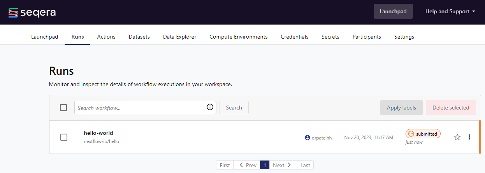

# Run workflows for benchmarking on Seqera Platform

## Table of contents
1. [Prerequisites](#prerequisites)
2. [Overview](#overview)
3. [Launching hello workflow from the Launchpad](#launching-hello-workflow-from-the-launchpad)
4. [Run benchmarks for the custom workflow](#run-benchmarks-for-the-custom-workflow)
   - [YAML format description](#yaml-format-description)
   - [Launching the custom workflow](#launching-the-custom-workflow)

### 1. Prerequisites

- You have setup a Fusion V2 and plain S3 compute environment in the Seqera Platform in the [previous section](../02_setup_compute/README.md).
- You have created an S3 bucket for saving the workflow outputs.
- You have created an S3 bucket containing the input samplesheet for the workflow or have uploaded the samplesheet to the [workspace as a Dataset](https://docs.seqera.io/platform/24.1/data/datasets).
- You have setup your custom and hello world workflows on the Launchpad as described in the [previous section](../03_setup_pipelines/README.md).

### 2. Overview

This directory contains YAML configuration files to launch the workflows on the Seqera Platform:

- `hello_world_fusion.yml`: This configuration is to launch the hello world workflow on the Seqera Platform with the Fusion V2 compute environment.
- `hello_world_plains3.yml`: This configuration is to launch the hello world workflow on the Seqera Platform with the plain S3 compute environment.
- `hello_world_fusion_snapshot.yml`: This configuration is to launch the hello world workflow on the Seqera Platform with the Fusion snapshot compute environment.
- `example_workflow_A_fusion.yml`: This configuration is to launch the custom workflow on the Seqera Platform with the Fusion V2 compute environment.
- `example_workflow_B_plains3.yml`: This configuration is to launch the custom workflow on the Seqera Platform with the plain S3 compute environment.
- `example_workflow_A_fusion_snapshots.yml`: This configuration is to launch the custom workflow on the Seqera Platform with the Fusion snapshot compute environment.

We will launch the hello world workflow from the Launchpad to ensure that the Seqera Platform is working as expected with both the Fusion V2 and plain S3 compute environments before running the benchmarks for the custom workflow.

## 3. Launching hello workflow from the Launchpad

We have provided separate YAML files [`hello_world_fusion.yml`](../04_run_benchmarks/launch/hello-world-fusion.yml) and [`hello_world_plains3.yml`](../04_run_benchmarks/launch/hello-world-plains3.yml) that contain the appropriate configuration to launch the Hello World pipeline we just added to the Launchpad.

Theses YAML files will append the date through the `$TIME` variable set in `env.sh`.  onto the run names. This can help with better organizing your benchmarking runs, especially if you launch multiple iterations.

Use the command below to launch the pipelines with both compute environments:

```shell
seqerakit ./launch/hello_world*.yml
```

```shell
DEBUG:root: Running command: tw launch nf-hello-world-fusion-$TIME --name nf-hello-world-test --workspace $ORGANIZATION_NAME/$WORKSPACE_NAME
DEBUG:root: Running command: tw launch nf-hello-world-plains3-$TIME --name nf-hello-world-test --workspace $ORGANIZATION_NAME/$WORKSPACE_NAME
DEBUG:root: Running command: tw launch nf-hello-world-fusion-snapshot-$TIME --name nf-hello-world-test --workspace $ORGANIZATION_NAME/$WORKSPACE_NAME
```

When you check the running pipelines tab of your Seqera Platform workspace, you should now see the Hello World pipelines being submitted for execution.


 


You may have to wait for the pipeline to begin executing and eventually complete. If you observe any failures, you will need to fix these systematically. If you don't, put your feet up and put the kettle on before moving on to the next step to run the benchmarks.

## 4. Run benchmarks for the custom workflow

Now that we have verified that the Seqera Platform is working as expected with both the Fusion V2 and plain S3 compute environments, we can run the benchmarks for the custom workflow.

We will use the same workflow configuration files that we used in the [previous section](../03_setup_pipelines/README.md).

### YAML format description

#### 1. Environment Variables in YAML

The YAML configurations utilize environment variables defined in the `env.sh` file. Here's a breakdown of the variables used in the example YAML:

| Variable | Description | Usage in YAML |
|----------|-------------|---------------|
| `$TIME` | Current date and time | `name` field (appended to run name) |
| `$ORGANIZATION_NAME` | Seqera Platform organization | `workspace` field |
| `$WORKSPACE_NAME` | Seqera Platform workspace | `workspace` field |
| `$COMPUTE_ENV_PREFIX` | Prefix for compute environment name | `compute-env` field |
| `$PIPELINE_OUTDIR_PREFIX` | Prefix for pipeline output directory | `params.outdir` field |

Using these variables allows easy customization of the launch configuration without directly modifying the YAML file, promoting flexibility and reusability across different environments and runs.

If we inspect the contents of [`launch/example_workflow_A_fusion.yml`](../04_run_benchmarks/launch/example_workflow_A_fusion.yml) as an example, we can see the overall structure is the same as what we used when adding pipelines.

#### 2. Pipeline YAML definition

The YAML file for launching a pipeline follows a specific structure. Let's examine the key components of this structure using an example:

```yaml
launch:
  - name: "your_pipeline_name-$TIME-fusion"
    pipeline: "your_pipeline_name"
    workspace: "$ORGANIZATION_NAME/$WORKSPACE_NAME"
    compute-env: "$COMPUTE_ENV_PREFIX_fusion_nvme"
    params:
      outdir: '$PIPELINE_OUTDIR_PREFIX/your_pipeline_name/results'
      input: 's3://your-bucket/input/samplesheet.csv'
```

<details>
<summary>Click to expand: YAML structure explanation</summary>

The top-level block is now `launch` which mirrors the `tw launch` command available on the Seqera Platform CLI to launch pipelines from source or from the Launchpad.

The nested options in the YAML also correspond to options available for that particular command on the Seqera Platform CLI. If you run `tw launch --help`, you will see that `--name`, `--workspace`, `--profile`, `--labels`, `--pre-run` and `--config` are available as options and will be provided to the `tw launch` command via this YAML definition. The `pipeline:` entry can be used to either specify the name of a pipeline that exists on the Launchpad, or a URL to a pipeline repository if running from source e.g. "https://github.com/nf-core/rnaseq". Here, we are using the pipeline name to launch the pipeline from the Launchpad that we setup earlier in the [previous section](../03_setup_pipelines/README.md).

</details>

#### Run Names and Parameters

##### Run Names
- Run names are appended with datetime and storage type (e.g., fusion, plains3)
- This naming convention helps organize your runs
- Feel free to modify or add more information to run names as needed

#### The `params` Section
- The `params` section in the YAML file is a `seqerakit`-specific option that allows you to define pipeline parameters directly within the YAML block, rather than in a separate file.
- This provides a convenient way to specify run-specific parameters within YAML
- For instance, many bioinformatics pipelines, including those from nf-core, use the `--outdir` parameter to specify where the final results should be stored. By including this in the `params` section of your YAML, you can easily set this for each run.
- If you've already defined pipeline parameters when you added the pipeline to the Launchpad, and you don't need to override or add any parameters for this specific run, you can omit the `params` section from your launch YAML file.

<details>
<summary>Using Datasets as input</summary>

> **Note**
> If you would like to use a Dataset as input, you can also include the URL to the dataset as your `input:` parameter. To do this, you can run the following CLI command to retrieve the URL:
> 
> ```bash
> tw datasets url -n <name_of_dataset> -w $ORGANIZATION_NAME/$WORKSPACE_NAME
> ```
> This command will return a URL that you can then provide as the value for the `input:` parameter:
> 
> ```yaml
>   input: https://api.cloud.seqera.io/workspaces/138659136604200/datasets/7DPM3wJTa6zDROKw6SGFLg/v/2/n/rnaseq-samples.csv
> ```

</details>

#### Additional Configuration Options

You can specify local paths to customize your pipeline execution:

1. **Nextflow config file**: Use the `config:` option
2. **Pre-run script**: Use the `pre-run:` option

These files are provided as empty placeholders in the repository:

- They allow you to override specific options during benchmarking
- The options are commented out in the provided YAML files
- You can uncomment and use them as needed
- See the [Pipeline Configuration]() and [Pre-run Script]() section for more details

### 3. Launching the custom workflow

We will now launch the custom workflow from the Launchpad using the YAML files we have defined in this repository. From the current directory, run the command below to launch the pipeline with the Fusion V2 compute environment:

```bash
seqerakit launch/example_workflow_A_fusion.yml
```

You should now see the custom workflow being submitted for execution in the Runs page of your Workspace on the Seqera Platform.

Similarly, you can launch the pipeline with the plain S3 compute environment by running the command below:

```bash
seqerakit launch/example_workflow_A_plains3.yml
```

Note, you can also specify paths to one or more named YAMLs present in the [`/launch`](./launch/) directory too to launch multiple pipelines in a single command:

```bash
seqerakit launch/example_workflow_A_fusion.yml launch/hello_world_plains3.yml
```

Even shorter, you can glob the YAML files to launch multiple pipelines in a single command:

```bash
seqerakit launch/*.yml
```

You may have to wait for the pipeline to begin executing and eventually complete. If you observe any failures, you will need to fix these systematically. If you don't, put your feet up and put the kettle on before moving on to the next step to run the benchmarks.

Before proceeding to the final part of this tutorial, ensure that the pipeline completes successfully at least once on both compute environments. Any failures may indicate infrastructure issues that should be addressed before attempting to run the pipeline on real-world datasets. For troubleshooting assistance, refer to the options in the [Support](../01_setup_environment/installation.md#support) section.

After confirming successful runs, you can move on to the next section, where we will pull run metrics from the Seqera Platform. This will allow you to compare the performance of your custom workflow across the Fusion V2 and plain S3 compute environments.

When you are ready to generate these performance reports, please reach out to your Seqera team for further guidance.