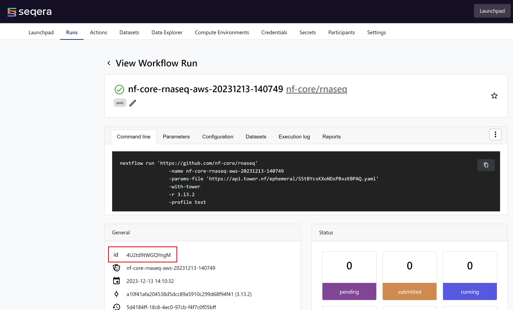

# nf-aggregate: Pipeline to collate benchmarking metrics

## Table of contents
1. [Prerequisites](#prerequisites)
2. [Samplesheet generation](#samplesheet-generation)
3. [Adding a Dataset](#adding-a-dataset)
4. [Running nf-aggregate](#running-nf-aggregate)
   - [Adding the Pipeline to the Launchpad](#adding-the-pipeline-to-the-launchpad)
   - [Launching the Pipeline](#launching-the-pipeline)
   - [Inspecting the results](#inspecting-the-results)

Once the runs for for your custom workflow have succeeded on Fusion V2 and Plain S3, you will need to compile a report highlighting key run-level metrics that can be used to assess whether your infrastructure has been correctly configured. We have written a Nextflow pipeline called [nf-aggregate](https://github.com/seqeralabs/nf-aggregate) that is able to do this in a standardized, reproducible manner.

The pipeline does the following:

1. Downloads run information via the Seqera CLI in parallel
2. Runs MultiQC to aggregate all of the run metrics into a single report

### Prerequisites

- Atleast one successful run for your custom workflow on Fusion V2 and Plain S3
- The Seqera Platform run identifiers for the runs you want to aggregate
- The `runs_ids.csv` file containing the Seqera Platform run identifiers for the runs you want to aggregate, see [Samplesheet generation](#samplesheet-generation) for more details

## Samplesheet generation

Before you run the nf-aggregate pipeline, you will need to generate a samplesheet that contains the Seqera Platform run identifiers corresponding to the nf-core pipelines that have finished successfully.

### Manual creation

The run identifier can be be found under the **General** information section in the Runs page next to the `id` icon:



You can manually copy the run identifiers for the completed runs from the UI and create a 2-column samplesheet called `runs_ids.csv`, where the `workspace` column corresponds to the `<ORGANIZATION>/<WORKSPACE>` in the Platform.

```
id,workspace
4Bi5xBK6E2Nbhj,community/showcase
4LWT4uaXDaGcDY,community/showcase
38QXz4OfQDpwOV,community/showcase
6Bi5xBK6E2Nbhj,community/showcase
7LWT4uaXDaGcDY,community/showcase
88QXz4OfQDpwOV,community/showcase
```

### Adding a Dataset

To use the `runs_ids.csv` file as input to nf-aggregate, add it to your Seqera Platform workspace as a Dataset with the following Seqera CLI command:

```bash
tw datasets add run_ids.csv --name nf-aggregate-benchmark-ids --header --workspace $SEQERA_ORGANIZATION_NAME/$SEQERA_WORKSPACE_NAME
```

You will need the Dataset URL from the Platform in order to run nf-aggregate from the command-line. The following command will get the Dataset URL and create a new environment variable called `$DATASET_URL`:

```bash
export DATASET_URL=$(tw -o json datasets url --name nf-aggregate-benchmark-ids --workspace $SEQERA_ORGANIZATION_NAME/$SEQERA_WORKSPACE_NAME | jq .datasetUrl | tr -d '"')
```

You can double-check the value of `$DATASET_URL` with the command below:

```console
echo $DATASET_URL

https://api.tower.nf/workspaces/100452700310173/datasets/4f2d6orAHG5j7YY1DQtEzP/v/1/n/run_ids.csv
```

## Running nf-aggregate

### Adding the Pipeline to the Launchpad

You can add nf-aggregate to the Launchpad by running `seqerakit` with the [nf-aggregate.yml](./pipelines/nf-aggregate.yml) file that defines the details of the pipeline:

```console
$ seqerakit ./pipelines/nf-aggregate.yml

DEBUG:root: Overwrite is set to 'True' for pipelines

DEBUG:root: Running command: tw -o json pipelines list -w $SEQERA_ORGANIZATION_NAME/$SEQERA_WORKSPACE_NAME
DEBUG:root: Running command: tw pipelines add --name nf-aggregate --workspace $SEQERA_ORGANIZATION_NAME/$SEQERA_WORKSPACE_NAME --description 'Pipeline to aggregate pertinent metrics across pipeline runs on the Seqera Platform.' --compute-env $SEQERA_COMPUTE_ENV_NAME --revision 0.3.0 https://github.com/seqeralabs/nf-aggregate
```

### Launching the Pipeline

Once the pipeline has been added to the Launchpad, we can launch it from the command-line using the `$DATASET_URL` defined as input in [nf-aggregate.yml](../seqerakit/launch/nf-aggregate.yml).

```console
$ seqerakit seqerakit/launch/nf-aggregate.yml

DEBUG:root: Running command: tw launch --name nf-aggregate --workspace $SEQERA_ORGANIZATION_NAME/$SEQERA_WORKSPACE_NAME --pre-run ./seqerakit/pipelines/pre_run.txt --config ./seqerakit/pipelines/nextflow_config.txt nf-aggregate --params-file /home/joebloggstmp/tmpi0pzstix.yaml
```

After running this command, you should now see the pipeline being submitted for execution in the Runs page of your Workspace on the Seqera Platform.

> **Note**: If you are using a Seqera Platform Enterprise instance that is secured with a private CA SSL certificate not recognized by default Java certificate authorities, you will need to amend the `params` section in the [nf-aggregate.yml](../seqerakit/launch/nf-aggregate.yml) file before running the above seqerakit command, to specify a custom `cacerts` store path through `--java_truststore_path` and optionally, a password with the `--java_truststore_password` pipeline parameters. This certificate will be used to achieve connectivity with your Seqera Platform instance through API and CLI.

### Inspecting the results

The results from the pipeline will be published in the path specified by the `--outdir` parameter in [nf-aggregate.yml](../seqerakit/launch/nf-aggregate.yml). The MultiQC report generated by nf-aggregate will contain all of the core run-level metrics from the nf-core pipeline benchmarking. Further documentation for all of the results published by the pipeline can be found in the [nf-aggregate docs](https://github.com/seqeralabs/nf-aggregate/tree/main#output).

The last step of this guide is to zip the `results/` folder generated from nf-aggregate into a tar archive. This folder will be used to generate an interactive benchmarking report in the [next section](../06_generate_report/README.md). This interactive report will provide a more detailed breakdown of the results on a per-task and process level for each of the runs between the two infrastructure/storage configurations.