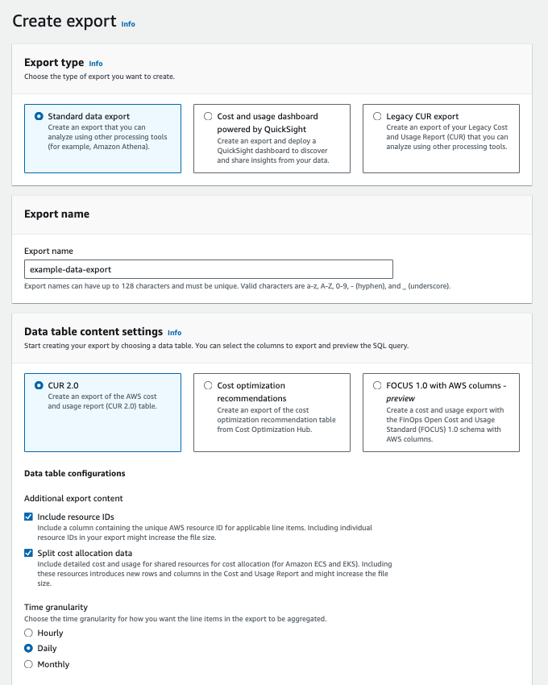

# Step-by-Step Guide: Enabling Split Cost Allocation in AWS

## Activate Resource Tags in Your AWS Account

When a run is executed in a compute environment with associated resource labels, Seqera Platform propagates the labels to a set of resources (listed below), while Nextflow distributes the labels for the resources spawned at runtime. If the compute environment is created through Forge, the compute environment will propagate the tags to the resources generated by the Forge execution. At execution time, when the jobs are submitted to Batch, the requests are set up to propagate tags to all the instances and volumes created by the head job.

The [`forge-policy.json`](https://github.com/seqeralabs/nf-tower-aws/blob/master/forge/forge-policy.json) file contains the roles needed for Batch Forge-created AWS compute environments to tag AWS resources. Specifically, the required roles are `iam:TagRole`, `iam:TagInstanceProfile`, and `batch:TagResource`.

### To include the cost information associated with your resource labels in your AWS billing reports:
1. Sign in to the AWS Management Console and open the AWS Billing and Cost Management console at [https://console.aws.amazon.com/billing/](https://console.aws.amazon.com/billing/)
2. In the navigation pane, choose **Cost allocation tags**.
3. Select the tag keys that you want to activate.
4. Choose **Activate**.

After you create and apply user-defined tags to your resources, it can take up to 24 hours for the tag keys to appear on your cost allocation tags page for activation. It can then take up to 24 hours for tag keys to activate.

### To view and manage the resource labels applied to AWS resources by Seqera and Nextflow:
1. Go to the AWS [**Tag Editor**](https://docs.aws.amazon.com/tag-editor/latest/userguide/find-resources-to-tag.html) (as an administrative user) and follow these steps:
    - Under **Find resources to tag**, search for the resource label key and value in the relevant search fields under **Tags**.
    - Refine your search by AWS region and resource type if needed.
    - Select **Search resources**.
2. Resource search results will display all the resources tagged with your given resource label key and/or value.

For detailed instructions, refer to this [AWS guide](https://docs.aws.amazon.com/awsaccountbilling/latest/aboutv2/activating-tags.html).

## Applying Resource Labels

In Nextflow, labels can also be set through [configuration](https://www.nextflow.io/docs/latest/process.html#process-resourcelabels) and applied to pipeline executions. These labels propagate to resources such as ECS tasks and Batch jobs, tagging only the jobs themselves. This will allow you to retrieve granular process-level and task-level costs through user-defined tags in the Data Export you will generate.

If labels are defined at the compute environment level (using the “Resource labels” field during CE creation), all runs will inherit them. However, individual resources like EC2 instances will only carry the compute environment-level labels, not the custom process labels. Labels for pipelines and runs can be edited dynamically without changing the compute environment's labels.

### Example:
```groovy
process {
    resourceLabels = {
        [
            uniqueRunId: TOWER_WORKFLOW_ID,
            pipelineProcess: task.process.toString(),
            pipelineTag: task.tag.toString(),
            pipelineCPUs: task.cpus.toString(),
            pipelineMemory: task.memory.toString(),
            pipelineTaskAttempt: task.attempt.toString(),
            pipelineContainer: task.container.toString(),
            taskHash: task.hash.toString(),
            pipelineUser: workflow.userName.toString(),
            pipelineRunName: workflow.runName.toString(),
            pipelineSessionId: workflow.sessionId.toString(),
            pipelineResume: workflow.resume.toString(),
            pipelineRevision: workflow.revision.toString(),
            pipelineCommitId: workflow.commitId.toString(),
            pipelineRepository: workflow.repository.toString(),
            pipelineName: workflow.manifest.name.toString()
        ]
    }
}
```

Please be aware that all of these labels have to be activated in the AWS console before using them.

## Enable Split Cost Allocation in Your AWS Account

With Split Cost Allocation Data, you can now easily distribute your Amazon EC2 instance costs at the ECS task level based on the actual consumption of the vCPU and memory utilized by your ECS tasks and your AWS Batch jobs. The granular cost information at the container task level lets you analyze the cost efficiency of tasks from Nextflow workflow executions.

### To enable split cost allocation:
1. Sign in to the AWS Management Console and open the Billing and Cost Management console at [https://console.aws.amazon.com/cost-management/home](https://console.aws.amazon.com/cost-management/home).
2. In the navigation pane, go to **Cost Management Preferences**.
3. Under **General**, in the **Split Cost Allocation Data** section, choose the following:
    - **Amazon Elastic Container Service (Amazon ECS)** to opt into Amazon ECS only (required for retrieving costs from your Nextflow workflows executed on AWS Batch).
    - **Amazon Elastic Kubernetes Service (Amazon EKS)** to opt into Amazon EKS only.
4. Click **Save preferences**.


Once you’ve opted in, you can choose to have cost and usage data for container-level resources included in Data Exports, formerly known as Cost and Usage Reports (CUR). For detailed instructions, refer to the [AWS guide](https://docs.aws.amazon.com/cur/latest/userguide/enabling-split-cost-allocation-data.html).

## Create a Data Export with Split Cost Allocation Data

AWS Split Cost Allocation Data works by generating container-level costs based on the resource consumption of each container within an EC2 instance. It introduces new usage records and cost metric columns for each containerized resource ID, such as ECS tasks, into AWS Data Exports (or CUR). These costs are calculated based on the amortized cost of the EC2 instance and the percentage of CPU and memory resources consumed by each container. This approach ensures that costs are allocated precisely according to resource usage, providing a clear and detailed cost breakdown.

### To include cost and usage data in your report:
1. Sign in to the Billing and Cost Management console at [https://console.aws.amazon.com/billing/home#/](https://console.aws.amazon.com/billing/home#/).
2. In the navigation pane, choose **Data Exports**.
3. Click **Create** to generate a new Data Export/CUR.
4. Select the **Standard data export** in **Export type**.
5. Specify a name for your report.
6. In the **Data table content settings** section:
    - Select **CUR 2.0**.
    - Under **Data table configurations**, select **Include resource IDs and Split cost allocation data**.

    

7. Specify a **Time granularity** of your choosing.
8. When generating the initial report, it is recommended to select all columns under **Column selection**.
9. In the **Data export delivery options** section, select **Parquet** under **Compression type and file format**.

    
    
10. Under **File versioning**, it is recommended to select **Overwrite existing data export file** to save on S3 storage costs.
11. Specify the S3 bucket and optionally bucket prefix to export your report into under **Data export storage settings**.
12. Click **Create**.